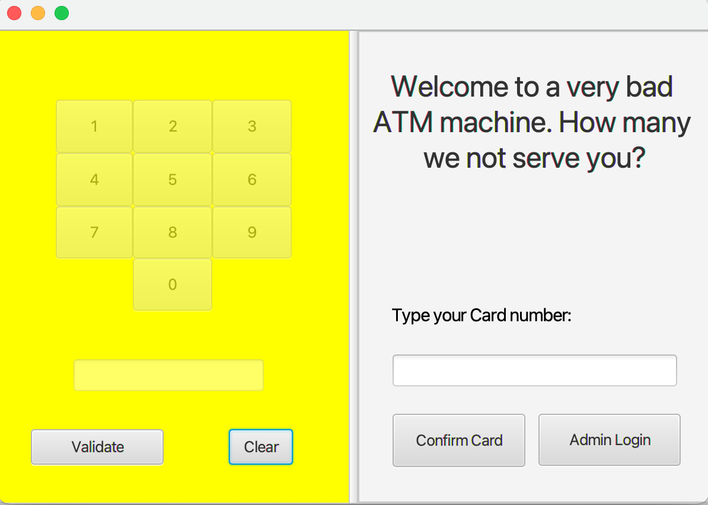

# Tut12 Group 1 Assignment 1 

This project is of a database-connected and persistent ATM machine, allowing for withdrawal, deposit and checking account balance.

## Installation

This program requires Gradle 7.2 and Java 16 to run. To install the program, run `git clone https://github.sydney.edu.au/SOFT2412-2021S2/A1_group1.git`, then change directory into the project by running `cd A1_group1`. Next, type `./gradlew build` to build the program 

## Running 

To run the program, execute `./gradlew run` to launch the main GUI window, and `gradle clean` to remove all build content.

## Testing, Test Coverage and Outputs

**To run tests:**

`./gradlew test`. Note that this will also create a jacoco test coverage report in the *app/build/jacocoTestReports*.

**Explcitly generate a test coverage report:**

First run the tests as above. Then run `./gradlew jacocoTestReport`. The html reports are stored in *app/build/jacocoTestReports* directory. Open index.html in a browser to view the reports.

**To generate a fat-.jar**

Run `./gradlew shadowJar` to generate a fat .jar file containing all dependencies under `app/build/libs/`.

## Generating Documentation

### Main Documentation

Run `./gradlew genDocs`

The documentation can be found in the *app/docs/mainDocumentation* directory. To view the docs in your browser, open *app/docs/mainDocumentation/index.html*.

### Test Documentation

Run `./gradlew genTestDocs`

The documentation can be found in the *app/docs/testDocumentation* directory. To view the docs in your browser, open *app/docs/testDocumentation/index.html*.

## Contributing

Contributions are always welcome. To contribute, fork the repository, create a change on a branch and create a pull request!

